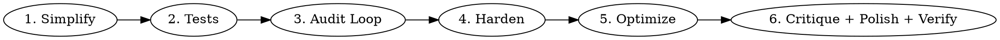
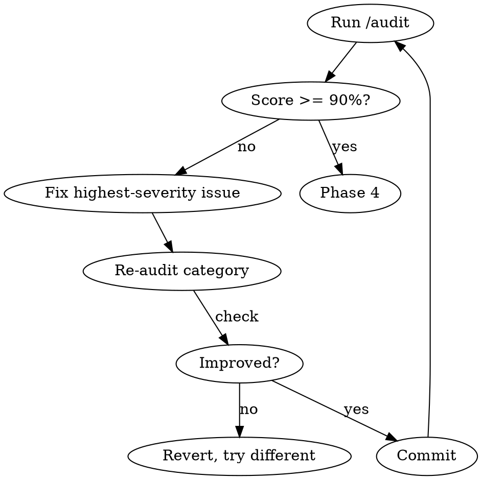

Six-phase pipeline that drives a feature from "works" to "ships with confidence." Each phase builds on the last. One fix per iteration, revert if no improvement, commit each win.



## Phase 1: Simplify

Run `/simplify` — review changed code for reuse, quality, and efficiency. Fix duplication, dead code, overly complex patterns.

**Exit when:** No simplify issues remain.

## Phase 2: Tests

Run `/vitest` on the feature area. Follow the project vitest skill for patterns.

```bash
cd packages/app && npx vitest run src/path/__tests__/
cd packages/backend && npx vitest run core/routes/path/__tests__/
```

- Run existing tests first — establish baseline (anything already broken?)
- Write missing tests for changed code (bug fix = regression test first)
- Coverage can only go up, never down (auto-ratchet thresholds)

**Exit when:** All related tests pass, coverage not decreased.

## Phase 3: Audit Loop

Run `/audit` on the target area. Fix issues by severity in a loop until score >= 90%.



**Rules:**
1. One fix per iteration — never batch
2. Critical > High > Medium > Low
3. Revert immediately if no improvement
4. Commit each win atomically

**Scoring:** `score = (1 - (critical*10 + high*5 + medium*2 + low*0.5) / max_possible) * 100`

**Stop early if:** 3 consecutive iterations with no gain, or only Low-severity remains.

## Phase 4: Harden

Run `/harden` on the target area. Stress-test with:
- Extreme inputs (empty, very long, special chars, emoji)
- Error scenarios (network failures, API errors, permission denied)
- Edge cases (zero items, 1000+ items, concurrent operations)

Fix each weakness found. Single pass, not a loop.

## Phase 5: Optimize

Run `/optimize` on the target area. Measure before and after:
- Core Web Vitals (LCP, INP, CLS)
- Bundle impact of changed code
- Unnecessary re-renders
- Image/asset optimization

**Only optimize what's measurably slow.** No premature optimization.

## Phase 6: Critique + Polish + Verify

Three skills in sequence as the final quality gate:

**`/critique`** — Design effectiveness evaluation:
- Visual hierarchy, IA, emotional resonance, composition, typography, color
- Nielsen heuristics (0-40 scale)
- AI slop detection
- Address top 3-5 priority issues using suggested commands (`/arrange`, `/typeset`, `/colorize`, etc.)
- Re-run `/critique` to confirm improvements landed

**`/polish`** — Final detail pass: alignment, spacing, consistency, interaction states, copy.

**`/expect`** — Adversarial browser testing:
```bash
EXPECT_BASE_URL=http://localhost:5173 expect-cli -m "Test [feature] end-to-end, then try to break it: empty inputs, rapid clicks, back button, refresh mid-flow. Verify error states and console." -y
```
If expect finds failures, fix and re-run until clean.

## Iteration Log

Track progress across all phases:

```
Phase 1: simplify — 2 dead exports removed, 1 abstraction collapsed
Phase 2: 4 tests added, all passing, coverage +2.1%
Phase 3: audit 58% → 92% (7 iterations, 2 reverts)
Phase 4: harden — 3 edge cases fixed
Phase 5: optimize — LCP -200ms, removed 2 re-renders
Phase 6: critique 28/40 → 34/40, polish clean, expect 4/4 passing
```

## Output

```
=== PERFECT: [area] ===

Simplify: N issues fixed
Tests: N added, coverage +X%
Audit: XX% → XX% (N iterations)
Harden: N edge cases fixed
Optimize: LCP Xms, CLS X
Critique: heuristics XX/40
Polish: clean
Expect: N/N passing

Status: SHIP IT
```

## Skip Phases

Not every feature needs all 6. Skip what doesn't apply:
- Backend-only change → skip phases 3-6 (audit/harden/optimize/critique+polish are UI)
- Styling-only change → skip phases 1-2 (simplify/tests)
- Hotfix → phases 1-3 + expect only

Use judgment. The phases exist so you don't forget steps, not to create busywork.
